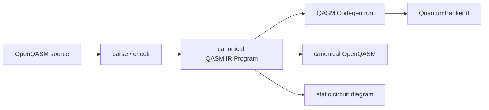

# LeanQASM

LeanQASM is a compile-time OpenQASM 3.0 frontend embedded in Lean 4. It parses and
type-checks OpenQASM, lowers accepted programs to a canonical `QASM.IR.Program`, and
executes that IR with a portable Lean interpreter. Device behavior remains behind a
small `QuantumBackend` interface.



The canonical IR is the shared boundary: execution, emission, and visualization consume
the same resolved program instead of rebuilding semantics from source.

## Build and test

```sh
lake build
lake test
```

## Repository layout

Production modules follow the compilation pipeline and keep extensions beside the layer
they extend:

- `QASM/Frontend/` contains source semantics and type analysis;
- `QASM/IR/` owns the canonical, resolved program representation;
- `QASM/Lowering/` translates checked frontend programs into IR;
- `QASM/Codegen/` quotes and interprets persistent IR;
- `QASM/Runtime/` contains concrete backend implementations, while `QASM/Runtime.lean`
  owns the portable value and backend boundary;
- `QASM/Diagram/` owns the presentation model, IR projection, and HTML integration;
- `QASM/Emit/` owns canonical OpenQASM serialization;
- `QASM/Elaboration/` contains Lean command parsing, while `QASM/Elaboration.lean`
  coordinates the complete compile-time pipeline.

Runnable examples live under `Examples/`; executable and standalone regression modules
live under `Tests/`. The top-level `QASM.lean` remains the only public aggregation module.


## The `qasm!` interface

Inline programs name their generated Lean namespace explicitly. The OpenQASM body is
scanned as a balanced raw block, so nested braces, strings, and comments are not tokenized
as Lean. `using` accepts an ordinary `QASM.ElabOptions` term when configuration is
needed; omitting it selects the portable OpenQASM 3.0 defaults.

Inline bodies conventionally use two additional spaces relative to the surrounding
`qasm!` command.

```lean
import QASM

open QASM

qasm! Example {
  OPENQASM 3.0;
  input int[32] limit;
  output int[32] result;
  int[32] value = 0;
  for uint i in [0:limit] {
    if (i == 2) { continue; }
    value += 1;
  }
  while (value < 5) { value += 1; }
  result = value;
}
```

The command creates:

- `Example.Inputs` and `Example.Outputs`, with native typed fields such as
  `QASM.SInt 32`, `BitVec n`, `Float`, or `QASM.FixedArray element shape`;
- `Example.program : QASM.IR.Program`, containing resolved types and identifiers,
  structured control flow, callable and gate declarations, target settings, and source
  metadata;
- `Example.execute`, a typed boundary wrapper that encodes inputs, evaluates
  `Example.program` through `QASM.Codegen.run`, and decodes outputs.

```lean
#check Example.Inputs
#check Example.Outputs
#check Example.program
#check Example.execute
```

`Example.program` is executable data rather than generated per-program Lean control flow.
For example, `#print Example.program` shows OpenQASM `if` and `for` statements as
`QASM.IR.Proc.branch` and `QASM.IR.Proc.forLoop`; `#print Example.execute` shows the
interpreter wrapper.

### Circuit diagrams

`#html Example.program` derives and renders a static circuit diagram from the canonical
IR in the Lean infoview. For example:

```lean
qasm! Bell {
  OPENQASM 3.0;
  include "stdgates.inc";
  qubit[2] q;
  h q[0];
  cx q[0], q[1];
}

#html Bell.program
```

Diagrams are static source views. They show every control-flow branch and loop body
once; gate and quantum-subroutine calls remain opaque and named. Exact controlled gates
and swaps use conventional glyphs, while other or ineligible operations use labeled
boxes. Dynamic target sets are marked approximately. Rendering never executes inputs or
measurements, chooses outcomes, or selects a control-flow path.

Target widths and the opt-in extended dialect are supplied directly after `using`. Strict
OpenQASM 3.0 is the default; `switch` and `nop` require `.extended`.

```lean
qasm! ExtendedExample {
  OPENQASM 3.0;
  output int[32] result;
  switch (1) {
    case 1 { result = 42; }
  }
} using {
  target := { intWidth := 32, uintWidth := 32, floatWidth := 64, angleWidth := 64 }
  dialect := .extended
}
```

The file form resolves its path relative to the current Lean source file. It derives the
generated namespace from the sanitized file stem: the example below creates `example.execute`.
Nested `include` statements are resolved relative to their containing file and then through
`ElabOptions.includePaths`; `stdgates.inc` is intrinsic.

```lean
qasm! "circuits/example.qasm"
```

## Backend boundary

Generated `execute` wrappers are polymorphic over a monad, qubit representation, and
backend error type:

```lean
class QASM.QuantumBackend (m : Type u -> Type v) (Qubit Error : outParam (Type u)) where
  allocate : Nat -> m (Except Error (Array Qubit))
  apply : QASM.Unitary Qubit -> m (Except Error Unit)
  measure : Qubit -> m (Except Error Bool)
  reset : Qubit -> m (Except Error Unit)
  barrier : QASM.Barrier Qubit -> m (Except Error Unit)
```

### Trace backend

`TraceBackend` is a deterministic state-and-log backend for running generated
programs without a device integration:

```lean
let (result, trace) := TraceBackend.run
  (Example.execute (qasmM := TraceBackend.M) { limit := SInt.ofInt 41 })

let (quantumResult, quantumTrace) := TraceBackend.run
  (Bell.execute (qasmM := TraceBackend.M) {})
```

`TraceBackend.State.operations` records allocation, unitary, reset, barrier, and
measurement labels. `TraceBackend.initial #[...]` supplies deterministic
measurement outcomes. The backend records execution effects; it does not model
physical quantum state.

While interpreting the canonical IR, qubit allocation, gates and modifiers, measurement,
reset, and barriers are delegated through this interface. Classical expressions, arrays
and slices, subroutines, aliases, casts, complex values, ranges, and structured control
flow are evaluated by `QASM.Codegen.run`.

OpenQASM features whose meaning is explicitly backend-dependent are parsed and
represented by the frontend, but portable elaboration rejects them with a
compile-time diagnostic. These are `extern`, calibration/OpenPulse,
target-relative timing (`dt`, `delay`, designators, `durationof`, `stretch`),
and physical `$n` qubits. SI duration literals and classical duration arithmetic
remain portable. Pragmas and annotations are retained in `QASM.IR.Program`.

User gates, including modified user gates, are lowered to backend-independent
`QASM.IR.Circuit` values. During execution the interpreter resolves those circuits into
`Unitary` trees. The intrinsic standard library is enabled by `include "stdgates.inc";`
and resolves to `U`, `gphase`, sequences, and modifiers rather than opaque target gate
names.

## Standalone frontend

Parsing and normalized printing remain available without elaborating a
program:

```lean
match QASM.parse "OPENQASM 3.0; qubit q; h q;" with
| .ok program => IO.println program.toQasm
| .error error => IO.eprintln s!"{error}"

#check QASM.parseFile
```

The exact support matrix, backend boundary, and remaining semantic limitations
are tracked in [CONFORMANCE.md](CONFORMANCE.md).

## Acknowledgements

This project is developed under the umbrella of the AutoRes Lean-Quantum
Project.
