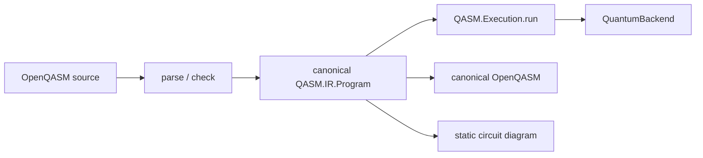

# LeanQASM

LeanQASM is a compile-time OpenQASM 3.0 frontend embedded in Lean 4. It parses and
type-checks OpenQASM, lowers accepted programs to a canonical `QASM.IR.Program`, and
executes that IR with a portable Lean interpreter. Device behavior remains behind a
small `QuantumBackend` interface.


```mermaid
flowchart LR
    Source["OpenQASM source"] --> Frontend["parse / check"]
    Frontend --> IR["canonical QASM.IR.Program"]
    IR --> Execute["QASM.Execution.run"]
    Execute --> Backend["QuantumBackend"]
    IR --> Emit["canonical OpenQASM"]
    IR --> Diagram["static circuit diagram"]
```

The canonical IR is the shared boundary: execution, emission, and visualization consume
the same resolved program instead of rebuilding semantics from source.

## Build and test

```sh
lake build
lake test
```

## Repository layout

Production modules follow the compilation pipeline and keep extensions beside the layer
they extend:

- `QASM/Frontend/` contains source semantics and type analysis;
- `QASM/IR/` owns the canonical, resolved program representation;
- `QASM/Lowering/` translates checked frontend programs into IR;
- `QASM/Execution/` interprets canonical IR through the portable backend boundary;
- `QASM/Runtime/` contains concrete backend implementations, while `QASM/Runtime.lean`
  owns the portable value and backend boundary;
- `QASM/Diagram/` owns the presentation model, IR projection, and HTML integration;
- `QASM/Emit/` owns canonical OpenQASM serialization;
- `QASM/Elaboration/` contains Lean command parsing and IR quotation, while
  `QASM/Elaboration.lean` coordinates the complete compile-time pipeline.

Runnable examples live under `Examples/`; executable and standalone regression modules
live under `Tests/`. The executable aggregation module is `QASM.lean`. Mathematical reasoning uses the
separate `QASMVerification.lean` entry point.


## Quantum semantics and QFT definitions

`import QASMVerification` adds the Mathlib-based mathematical layer; `import QASM`
continues to use the executable library alone. Build the verification target explicitly:

```sh
lake build QASM QASMVerification lean_qasm_tests
lake test
```

The IR preserves decimal significands, decimal exponents, and named real constants.
Ordinary classical calculations remain finite-precision calculations. A symbolic gate
profile may extract `ExactRealExpr`; it rejects explicit casts, machine float literals,
and effectful calls. Gate formal arguments use `ScalarTy.gateAngle` rather than an
implicitly chosen `angle[64]`. The current runtime approximates those arguments using
Float; this adapter is not an exact mathematical interpretation.

| Definition | Contract |
| --- | --- |
| `RealEval` | Domain-checked symbolic reals with a supplied typed integer evaluator |
| `CircuitEval` | Checked qubit boundaries, composition, tensor, routing, adjoints, integer powers and controls |
| `NativePrimitive` | Actual U, gphase, H, P, CP, identity and SWAP matrices; other recipes require expansion |
| `EffectSemantics.Exec` | Finite successful execution, including `end` during expression evaluation |
| `JointState`, `TotalUnitaryCorrect` | Classical store, handle bindings, unitary action and total-correctness contract |
| `WellFormedCircuit` | Circuit with an interpretation derivation and unitarity proof |
| `Instrument` | Finite Kraus lists and an explicit completeness proof |
| `IR.QFT.body` | Transformation of an already-bound register, with residual descending loops and final swaps |
| `IR.QFT.canonical` | Allocation plus QFT, width `max 3 n`, index width `n + 2`; size zero is empty |
| `qftMatrix`, `fourier` | Little-endian gate-family interpretation and positive-sign Fourier matrix |

Composition executes its left child first; tensor puts its left child on low bits.
Routing permutations describe coordinate changes, while SWAP is a physical operation.
The native U definition preserves its global phase, including under control.

The proof modules establish the following kernel-checked results:

| Theorems | Proved scope |
| --- | --- |
| `nativeU_factorization`, `nativeProfile_unitary` | Native U including global phase, and all seven primitives of the closed QFT profile, for arbitrary real arguments |
| `hadamard_nativeRecipe` | H equals native U followed by the required global phase, in the exact real model |
| `unitary_sequential`, `unitary_adjoint`, `unitary_integerPower` | Closure for arbitrary register sizes |
| `runtime_angle_half`, `runtimeHalves_exact`, `qft_runtime_phase` | Concrete `Value.binary` divisions starting from the half-turn bit pattern, and their exact dyadic real values under the width bound |
| `qftSteps_valid`, `qftCore_succ` | All generated gate indices are valid; the outer-loop successor equation holds for every size |
| `runQFT_iff` | Valid reference gate-sequence execution equals `qftMatrix n` on an arbitrary initial operator, for every size |
| `qftCorrect`, `qftCorrect_all` | Original `qftMatrix n = fourier n` for every natural size, including physical SWAPs, normalization and positive Fourier sign |
| `qftProgramCorrect_all` | Original residual `IR.QFT.body` terminates normally, has unique Fourier action and no faults in the exact shared-machine execution model, for every size |
| `QFTExecution.inner_iterations`, `body_totalCorrect`, `body_action` | Actual finite-width halving invariant, complete loop execution with all locals restored, and Fourier action on an arbitrary initial operator trace |
| `qftCore_matrix`, `swapRange_matrix` | Actual gate multiplication equals native path amplitudes; actual physical SWAP multiplication reverses basis rows |
| `binary_expansion`, `reverseBits_involution`, `bitReversal` | Binary reconstruction and a verified reversal permutation for every register width |
| `hadamard_row_action` | Actual Hadamard matrix multiplication reduces to exactly two predecessor basis states for every valid target and arbitrary accumulator |
| `qft_target_block`, `qft_top_hadamard` | Actual controlled-phase matrix fold reduces to a diagonal block; highest-target H agrees with identity tensor H for every width |
| `qft_target_phase`, `qftPathAmplitude_reversed_eq_fourier` | The native gate-path weight equals each Fourier component for every size, including normalization and reversal |
| `proc_simulation`, `proc_lifting` | All structured Proc constructors preserve and lift finite executions from atomic kernel laws |
| `control_refinement_iff` | Least fixed-point structured evaluation equals the declarative semantics for every Proc and atomic kernel |
| `machine_proc_refinement_iff` | Shared frame-machine evaluation equals declarative finite successful execution, including kernels that can fail |
| `runFrom_refinement_iff`, `run_refinement_iff` | Actual Option interpreter callbacks, all Proc constructors, typed input/output initialization and the public result boundary; no assumed whole-program simulation |
| `drive_failure` | Failure restores every lexical and iterator frame and skips all remaining control work, for any lawful tail monad |
| `trace_proc_refinement_iff` | Bidirectional equivalence between gate-trace and matrix-accumulating Proc semantics, for any event kernel; its atomic laws are discharged |
| `circuitEval_boundaries`, `routing_compose` | Interpretation derivations preserve declared qubit boundaries; adjacent verified routing maps cancel |
| `totalCorrect_transfer` | Total correctness transfers when both successful behavior and faults refine the specification |

`QFTCorrect` is proved for every size by `qftCorrect_all`. The definition of
`qftMatrix` still multiplies the original H/CP/SWAP gate list; it has not been replaced
with the Fourier formula. The shared `ControlMachine.step` and least fixed-point driver
now execute both top-level and nested `Execution.run` control. An operation can only
complete normally or end the program; failure unwinds lexical and iterator frames.

The concrete bidirectional runtime theorem uses `Option` effects and graphs of the
actual atomic callbacks. It characterizes finite successful results, including normal
whole-program termination. It proves neither fault freedom for arbitrary programs nor
an IO/device effect model. Generated `execute` wrappers now require `Lean.Order.MonadTail`
alongside `Monad`; standard IO, Option, Id and state transformers have instances (state
transformers require a nonempty state). Atomic expression/call correctness against an
independent classical specification and exact/approximate quantum backend laws remain
separate from the proved structured-control refinement.

`QFTProgramCorrect` is proved by `qftProgramCorrect_all` for the exact execution
model in `QFTExecution`. The original `IR.QFT.body` retains all three loops. The
proof evaluates their expressions, finite-width counters, stored angles and checked
wire indices, then constructs a finite normal shared-machine execution. Its trace
contains precisely the original H/CP/SWAP matrices; every successful result is the
Fourier matrix, no fault is possible, and all local bindings are restored. The proof
covers every natural size, including zero, and every profile satisfying `QFTRangeSafe`.
The register is already supplied, so the theorem concerns arbitrary input states.

This exact model uses the existing runtime `Value.binary` for angle division and
interprets gates by ideal complex matrices. Its signed arithmetic is checked within
the safe bounds; unsupported atomic operations fail explicitly. It is not an
independent specification of every interpreter atomic callback. The theorem does not
identify the runtime's final Float conversion with exact real angles. Backend
approximation, tensor/control unitarity and arbitrary-placement refinement, instrument
positivity/trace laws, and external-effect/divergence-sensitive semantics remain
separate obligations. No admitted proofs or new axioms supply these claims.

The standalone audit `lake env lean Tests/Verification.lean` prints the dependencies
of the main proof results. They use the ordinary Lean foundations (`propext`,
`Classical.choice`, `Quot.sound`), with no new quantum axioms or admitted proofs.

Regression tests cover exact decimal emission, a representable 64-bit angle that would
lose low bits through Float, small user-gate angles, and QFT execution and emission for
sizes zero through six, and preservation of lexical bindings and preceding writes on
a runtime failure. The general Fourier equality is established by the separate kernel proof.

## The `qasm!` interface

Inline programs name their generated Lean namespace explicitly. The OpenQASM body is
scanned as a balanced raw block, so nested braces, strings, and comments are not tokenized
as Lean. `using` accepts an ordinary `QASM.ElabOptions` term when configuration is
needed; omitting it selects the portable OpenQASM 3.0 defaults.

Inline bodies conventionally use two additional spaces relative to the surrounding
`qasm!` command.

```lean
import QASM

open QASM

qasm! Example {
  OPENQASM 3.0;
  input int[32] limit;
  output int[32] result;
  int[32] value = 0;
  for uint i in [0:limit] {
    if (i == 2) { continue; }
    value += 1;
  }
  while (value < 5) { value += 1; }
  result = value;
}
```

The command creates:

- `Example.Inputs` and `Example.Outputs`, with native typed fields such as
  `QASM.SInt 32`, `BitVec n`, `Float`, or `QASM.FixedArray element shape`;
- `Example.program : QASM.IR.Program`, containing resolved types and identifiers,
  structured control flow, callable and gate declarations, target settings, and source
  metadata;
- `Example.execute`, a typed boundary wrapper that encodes inputs, evaluates
  `Example.program` through `QASM.Execution.run`, and decodes outputs.

```lean
#check Example.Inputs
#check Example.Outputs
#check Example.program
#check Example.execute
```

`Example.program` is executable data rather than generated per-program Lean control flow.
For example, `#print Example.program` shows OpenQASM `if` and `for` statements as
`QASM.IR.Proc.branch` and `QASM.IR.Proc.forLoop`; `#print Example.execute` shows the
interpreter wrapper.

### Parameterized programs and proofs

Family binders introduce Lean natural-number parameters without evaluating them:

```lean
qasm! Sized (n : Nat) {
  OPENQASM 3.0;
  input bit[n] value;
  output bit[n] result;
  qubit[n] q;
  result = value;
}

#check Sized.program -- Nat → QASM.IR.Program
#check Sized.Inputs  -- Nat → Type
#check Sized.Outputs -- Nat → Type
#check Sized.Valid   -- Nat → Prop

theorem sized_input_width (n : Nat) :
    ((Sized.program n).inputs[0]!).var.type = .scalar (.bit (some n)) := by
  rfl

theorem sized_valid (n : Nat) : Sized.Valid (n + 1) := by
  simp [Sized.Valid]

def sizedExample := TraceBackend.run
  (Sized.execute 5 (by decide) { value := BitVec.ofNat 5 19 })
```

`program` is a normal, reducible Lean function containing concrete IR constructors and
open terms. It does not reparse QASM or run the compiler when called. Multiple parameters
use separate binders: `qasm! Family (n : Nat) (m : Nat) { ... }`. Their values are available
as immutable QASM constants, including inside subroutines and gate expressions. Runtime
inputs remain separate from these program-family parameters.

Widths, qubit counts, array extents, and constant aliases support symbolic `+`, `-`, and
`*`. Shapes are compared structurally after closed arithmetic and simple identity
normalization. A symbolic slice requires a concrete step of `1` or `-1`. Floating-point
widths, array-reference ranks, control counts, and statically expanded gate-body loops
still require concrete values. Use process-level `for` loops for parameter-dependent
iteration; those loops stay in IR. QASM declarations cannot shadow family parameters.

`Sized.Valid n` contains positivity conditions for all residual widths and extents.
It is a size precondition, not a proof of index safety, termination, or successful device
execution. The data function `program` remains available for all natural numbers;
`execute` requires a proof of `Valid`. For direct construction and transformations,
`IR.Program` also supports ordinary Lean functions independently of QASM quotation.

For general program laws, `Execution.Semantics.Exec` gives a relational account of finite
successful control flow, parameterized by an expression and atomic-operation model.
`Execution.Semantics.sequence_skip_left` proves neutrality of a leading `skip` for every
process and model, so it applies directly to `(Sized.program n).body` with `n` still open.
The completion-aware `EffectSemantics` additionally covers whole-program termination
during expression evaluation. `run_refinement_iff` connects all finite successful
Option executions of the actual interpreter to that model; the model uses its concrete
atomic callbacks. This control theorem does not assert ideal-matrix backend accuracy. `IR.Substitution` is total and proves that size/integer
substitution preserves circuit domains and codomains.

### Circuit diagrams

`#html Example.program` derives and renders a static circuit diagram from the canonical
IR in the Lean infoview. For example:

```lean
qasm! Bell {
  OPENQASM 3.0;
  include "stdgates.inc";
  qubit[2] q;
  h q[0];
  cx q[0], q[1];
}

#html Bell.program
```

Diagrams are static source views. They show every control-flow branch and loop body
once; gate and quantum-subroutine calls remain opaque and named. Exact controlled gates
and swaps use conventional glyphs, while other or ineligible operations use labeled
boxes. Dynamic target sets are marked approximately. Rendering never executes inputs or
measurements, chooses outcomes, or selects a control-flow path.

Target widths and the opt-in extended dialect are supplied directly after `using`. Strict
OpenQASM 3.0 is the default; `switch` and `nop` require `.extended`.

```lean
qasm! ExtendedExample {
  OPENQASM 3.0;
  output int[32] result;
  switch (1) {
    case 1 { result = 42; }
  }
} using {
  target := { intWidth := 32, uintWidth := 32, floatWidth := 64, angleWidth := 64 }
  dialect := .extended
}
```

The file form resolves its path relative to the current Lean source file. It derives the
generated namespace from the sanitized file stem: the example below creates `example.execute`.
Nested `include` statements are resolved relative to their containing file and then through
`ElabOptions.includePaths`; `stdgates.inc` is intrinsic.

```lean
qasm! "circuits/example.qasm"
```

## Backend boundary

Generated `execute` wrappers are polymorphic over a monad, qubit representation, and
backend error type:

```lean
class QASM.QuantumBackend (m : Type u -> Type v) (Qubit Error : outParam (Type u)) where
  allocate : Nat -> m (Except Error (Array Qubit))
  apply : QASM.Unitary Qubit -> m (Except Error Unit)
  measure : Qubit -> m (Except Error Bool)
  reset : Qubit -> m (Except Error Unit)
  barrier : QASM.Barrier Qubit -> m (Except Error Unit)
```

### Trace backend

`TraceBackend` is a deterministic state-and-log backend for running generated
programs without a device integration:

```lean
let (result, trace) := TraceBackend.run
  (Example.execute (qasmM := TraceBackend.M) { limit := SInt.ofInt 41 })

let (quantumResult, quantumTrace) := TraceBackend.run
  (Bell.execute (qasmM := TraceBackend.M) {})
```

`TraceBackend.State.operations` records allocation, unitary, reset, barrier, and
measurement labels. `TraceBackend.initial #[...]` supplies deterministic
measurement outcomes. The backend records execution effects; it does not model
physical quantum state.

While interpreting the canonical IR, qubit allocation, gates and modifiers, measurement,
reset, and barriers are delegated through this interface. Classical expressions, arrays
and slices, subroutines, aliases, casts, complex values, ranges, and structured control
flow are evaluated by `QASM.Execution.run`.

OpenQASM features whose meaning is explicitly backend-dependent are parsed and
represented by the frontend, but portable elaboration rejects them with a
compile-time diagnostic. These are `extern`, calibration/OpenPulse,
target-relative timing (`dt`, `delay`, designators, `durationof`, `stretch`),
and physical `$n` qubits. SI duration literals and classical duration arithmetic
remain portable. Pragmas and annotations are retained in `QASM.IR.Program`.

User gates, including modified user gates, are lowered to backend-independent
`QASM.IR.Circuit` values. During execution the interpreter resolves those circuits into
`Unitary` trees. The intrinsic standard library is enabled by `include "stdgates.inc";`
and resolves to `U`, `gphase`, sequences, and modifiers rather than opaque target gate
names.

## Standalone frontend

Parsing and normalized printing remain available without elaborating a
program:

```lean
match QASM.parse "OPENQASM 3.0; qubit q; h q;" with
| .ok program => IO.println program.toQasm
| .error error => IO.eprintln s!"{error}"

#check QASM.parseFile
```

The exact support matrix, backend boundary, and remaining semantic limitations
are tracked in [CONFORMANCE.md](CONFORMANCE.md).

## Acknowledgements

This project is developed under the umbrella of the AutoRes Lean-Quantum
Project.
